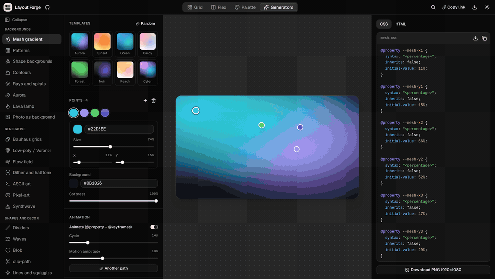
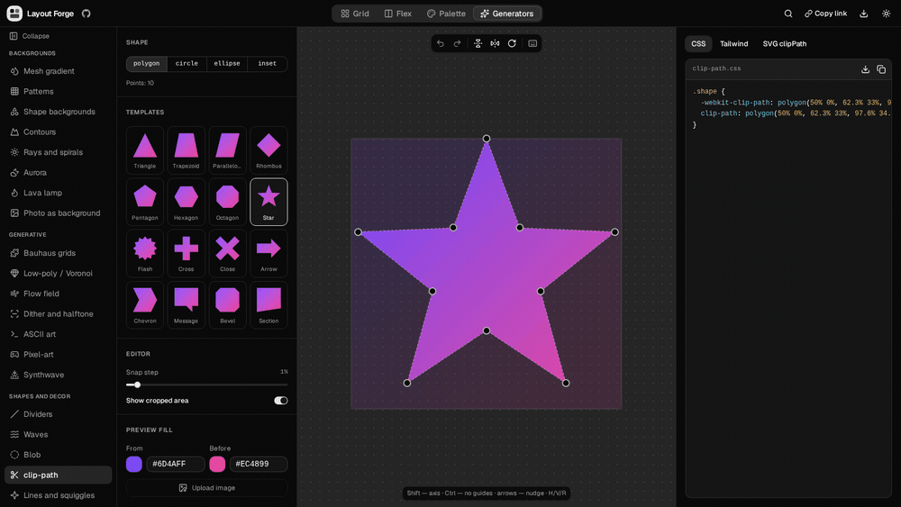
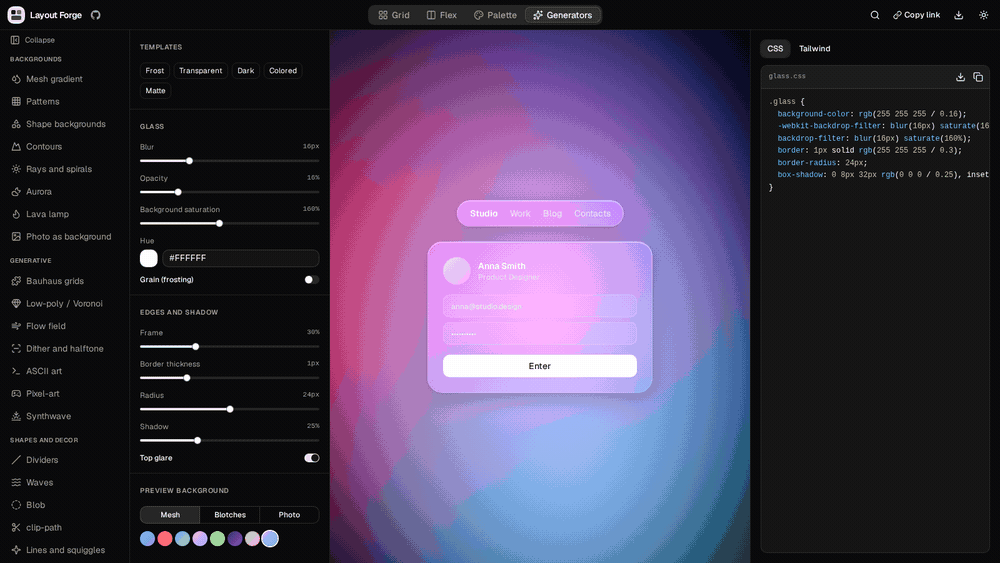
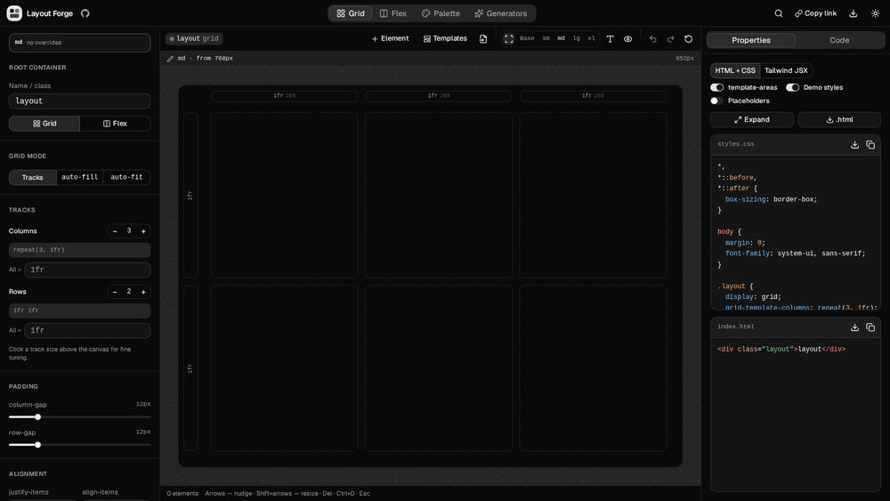
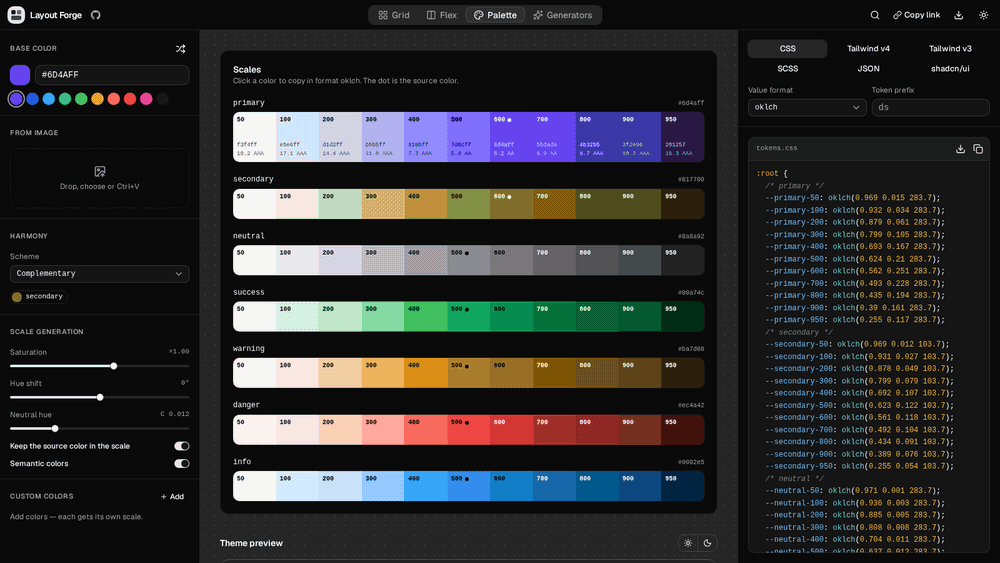
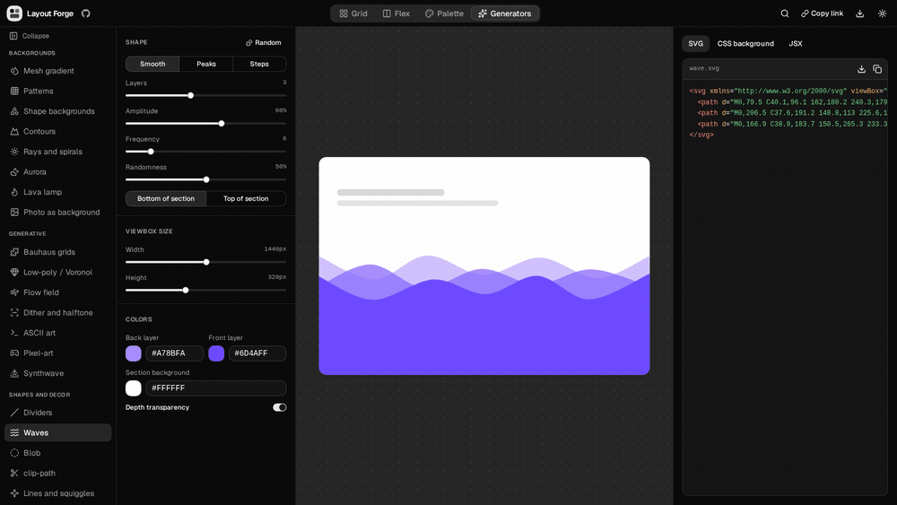

<div align="center">


# Layout Forge

**Visual generators for design and front-end work — in your browser, no account, no server.**

[](https://github.com/vumox/layout-forge/actions/workflows/ci.yml)
[](https://github.com/vumox/layout-forge/stargazers)
[](https://github.com/vumox/layout-forge/blob/main/package.json)
[](LICENSE)
[](CONTRIBUTING.md)


[Demo](https://vumox.github.io/layout-forge/) · [Why Layout Forge](#why-layout-forge) · [Quick start](#quick-start) · [Roadmap](ROADMAP.md) · [Discussions](https://github.com/vumox/layout-forge/discussions)

</div>

<p align="center"></p>

## Why Layout Forge

| What you need | Layout Forge | A typical single-purpose generator | A hosted design workspace |
|---|---|---|---|
| Several tasks in one place | 36 tools: layouts, palettes, backgrounds, shapes, effects and media | Usually one type of output | Depends on the product and plugins |
| Work directly with front-end code | Live CSS, HTML, JSX, Tailwind or SVG, depending on the tool | Usually focused on one format | Code export varies |
| Continue without a connection | Installable PWA; tools cached after the first complete online load | Depends on the site | Offline support varies |
| Share an editable result | Copy link embeds the active tool’s settings in the URL | Depends on the tool | Often a workspace or account link |
| Control the source | MIT license; run locally or self-host | License and source access vary | Usually a managed service |
| Start quickly | No signup; Ctrl+K or ⌘K finds every tool | Usually a direct editor | May require an account |

This compares workflows, not named competitors. Layout Forge focuses on browser-based visual generators and code export. Uploaded images and videos are not embedded in shared links; remote media still needs a connection.

## Share, search and install

- **Copy link** captures current settings, including layout trees, palette colors and generator seeds. Open the link in another browser to restore the result. Settings are compressed into the URL fragment and are not uploaded to a server. Anyone with the link can read them. Very large results should be exported as files.
- **Ctrl+K / ⌘K** opens search across all 36 tools. Type a name or category, use ↑ ↓ and Enter, or click a result. Esc closes the palette.
- **Install app** uses the browser’s install prompt when available. On Safari, use Share → Add to Home Screen. Once the initial download finishes, generators and their code exports work offline. An update notification lets you choose when to reload.

## Tool demos

Six short recordings from the live interface. Download these GIFs for README examples, release notes or posts.

| Mesh gradient | Clip-path |
|---|---|
|  |  |
| Glassmorphism | CSS Grid |
|  |  |
| Palette | Waves |
|  |  |

## Tool guides

Each guide has its own title, description, canonical URL and structured data:

- [Mesh gradient generator](https://vumox.github.io/layout-forge/tools/mesh-gradient/)
- [CSS clip-path generator](https://vumox.github.io/layout-forge/tools/clip-path/)
- [Glassmorphism CSS generator](https://vumox.github.io/layout-forge/tools/glassmorphism/)
- [CSS Grid generator](https://vumox.github.io/layout-forge/tools/css-grid/)

## Features

- **Layout:** drag & drop Grid, grid-area, subgrids, auto-fill / auto-fit, Flex, breakpoints, CSS import, export to CSS / Tailwind / JSX
- **Color:** palettes from a single color, CSS tokens, palette from an image
- **Decor:** clip-path, blob, waves, patterns, shadows, glassmorphism, dividers, arrows, sunburst, SVG lines, CSS mask
- **Generative graphics:** animated mesh gradients, aurora, lava, low-poly and Voronoi, flow field, contour lines, Bauhaus, dither, ASCII, pixel art
- **Animation and 3D:** CSS animations and effects, particles, three.js scenes, scroll video
- **Extras:** unit converter, device mockup editor, OG images, favicon generator

Everything runs locally: your files and images never leave the browser.

## Tools

Open any tool directly in the [live demo](https://vumox.github.io/layout-forge/):

| Group | Tools |
|---|---|
| **Layout** | [Grid](https://vumox.github.io/layout-forge/#grid) · [Flex](https://vumox.github.io/layout-forge/#flex) · [Palette](https://vumox.github.io/layout-forge/#palette) |
| **Backgrounds** | [Mesh gradient](https://vumox.github.io/layout-forge/#tools/mesh) · [Patterns](https://vumox.github.io/layout-forge/#tools/pattern) · [Shape backgrounds](https://vumox.github.io/layout-forge/#tools/scatter) · [Contours](https://vumox.github.io/layout-forge/#tools/topo) · [Rays and spirals](https://vumox.github.io/layout-forge/#tools/burst) · [Aurora](https://vumox.github.io/layout-forge/#tools/aurora) · [Lava lamp](https://vumox.github.io/layout-forge/#tools/lava) · [Photo as background](https://vumox.github.io/layout-forge/#tools/image) |
| **Generative** | [Bauhaus grids](https://vumox.github.io/layout-forge/#tools/bauhaus) · [Low-poly / Voronoi](https://vumox.github.io/layout-forge/#tools/lowpoly) · [Flow field](https://vumox.github.io/layout-forge/#tools/flow) · [Dither and halftone](https://vumox.github.io/layout-forge/#tools/dither) · [ASCII art](https://vumox.github.io/layout-forge/#tools/ascii) · [Pixel-art](https://vumox.github.io/layout-forge/#tools/pixel) · [Synthwave](https://vumox.github.io/layout-forge/#tools/synth) |
| **Shapes and decor** | [Dividers](https://vumox.github.io/layout-forge/#tools/divider) · [Waves](https://vumox.github.io/layout-forge/#tools/wave) · [Blob](https://vumox.github.io/layout-forge/#tools/blob) · [clip-path](https://vumox.github.io/layout-forge/#tools/clip) · [Lines and squiggles](https://vumox.github.io/layout-forge/#tools/line) · [Arrows](https://vumox.github.io/layout-forge/#tools/arrow) |
| **Effects** | [Glassmorphism](https://vumox.github.io/layout-forge/#tools/glass) · [CSS mask](https://vumox.github.io/layout-forge/#tools/mask) · [CSS effects](https://vumox.github.io/layout-forge/#tools/fx) · [Shadows](https://vumox.github.io/layout-forge/#tools/shadow) |
| **3D and motion** | [3D scenes](https://vumox.github.io/layout-forge/#tools/three) · [CSS animations](https://vumox.github.io/layout-forge/#tools/animation) · [Particles](https://vumox.github.io/layout-forge/#tools/particles) · [Scroll video](https://vumox.github.io/layout-forge/#tools/scroll) |
| **Media and assets** | [Mockups](https://vumox.github.io/layout-forge/#tools/mockup) · [OG images](https://vumox.github.io/layout-forge/#tools/og) · [Favicon](https://vumox.github.io/layout-forge/#tools/favicon) |
| **Typography** | [Font units](https://vumox.github.io/layout-forge/#tools/units) |

## Quick start

```bash
git clone https://github.com/vumox/layout-forge.git
cd layout-forge
npm install
npm run dev
```

Build with `npm run build` — the output in `dist/` is static and works on any host. Checks: `npm run typecheck`, `npm run lint`, `npm test`.

## Tech stack

React 19 · TypeScript · Vite · Tailwind CSS v4 · shadcn/ui (Base UI) · three.js

## Contributing

Have an idea? Join [Discussions](https://github.com/vumox/layout-forge/discussions) or add your use case to the pinned [What should we build next?](https://github.com/vumox/layout-forge/issues/15) issue. See [ROADMAP.md](ROADMAP.md) for current priorities.

Ideas, bug reports and PRs are welcome — see [CONTRIBUTING.md](CONTRIBUTING.md). To report a vulnerability, see [SECURITY.md](SECURITY.md).

## License

[MIT](LICENSE) © vumox
